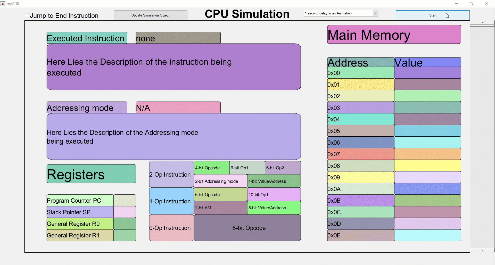
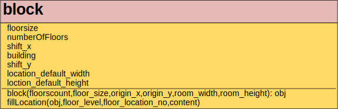
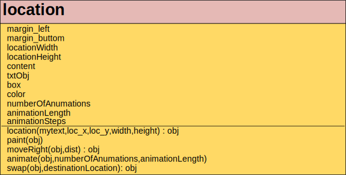

## CPU simulation using Matlab GUIDE
a simple CPU Simulation of how instructions are executed using Matlab GUIDE Animations.
   

   This code lays the basis of using Matlab guide to simulate the Execution of instructions in 
   a variable length instruction set CPU wth 4 registers which are:
   - PC (Program counter) 
   - SP (Stack pointer ) 
   - General purpose registers (R0 - R1)
   
    Compatible with Matlab R2018a
   

## Classes
   

block Class: Responsible for creating The locations on the GUI for example the registers locations are a block of size 4*1   
   
   
   
   
location Class: Each block could contain a location or more. This class provides the functions to paint the location needed with
Color, position and content. Please note that the moveRight - animate - swap functions are not implemented yet in the GUI.

## Included Functions/ Scripts
    myGUII
    startSimulation
    ReadMemory
    write2Excel
    ZeroOperand
    OneOperand
    TwoOperand
    dispInstructions  
    getColumnCount

## myGUII Function
    An instruction by instruction walkthrough of the program Execution steps in the simulationStruct.
    (Containing all the information needed for the Animation). This is the main GUI funcition and
    its main input is the simulationStruct which is created using startSimulation Function.

## startSimulation Function
    The main function in this project that receives the memory and Registers data from the Excel sheet
    and Creates a simulationStruct that is provided to the myGUI function to animate.
    The simulationStruct has the following properties:
    
    addressingModes:       {4×2 cell}
    supportedInstructions: {15×2 cell}
    memory:                [256×number_of_execution_cycles double]
    registers:             [4×number_of_execution_cycles double]
    IR:                    {1×number_of_execution_cycles cell}
    opcode:                [244 0 0 59 49 57 49 57 49 57 49 57 49 57 49 57 49 57 49 57 49 57 49 57 242 2 255]
    AM:                    [number_of_execution_cycles×2 double]
                       
## ReadMemory Function
    This Function is given the Path to the Excel sheet Containing the Initial Values
    for the Registers and Memory Locations.It returns an array containing the Data in the Excel sheet.

## write2Excel Function
    After the startSimulation Function is finished, This function could be called to store the memory and Registers
    Execution Cycles.
    
## ZeroOperand-OneOperand-TwoOperand Functions
    Each one of these function is for a certain type of the instructions.
    They execute the instruction and return the updated memory and Register array.
    
## getColumnCount Function
    returns the the column name in the Excel sheet based on the input number
    e.g.   column no.1 in Excel is 'A'  - Column no 26 in Excel returns 'AA'
    
 ## dispInstructions Function
    receives the sumulationStruct and displays the Instructions Executed from the start of the Program to the End.
      
        
## Attached components
    Images   ( holds the Images needed for the project )
    Resources
    memory.xlsx ( holds the memory and Register values that are loaded initially)
    oldSimulationData ( could be loaded initially to start animation fast)
    
    
  # Supported Features:
    - Supports variable length Instructions Execution.
    - Exports Memory contents with each cycle if needed to an External Excel sheet.
    - Could Accept new instructions to be implemented
    - The GUI animations are responsive with each Instruction execution
    - Could work with any new change with the Memory Values But you need
      to press the update simulation object button first.
    
  # Unsupported Features (Future work)
    - Cashing values in an external cache memory isn't supported but could be included in future versions.
    - Other famous Registers like MAR and MBR aren't included
    - Animating Instructions operations could be executed in the future,
      since class block contains swapping and animation functions
 
Special Thanks to:
  Dr. Hazem Shehata:
  https://www.linkedin.com/in/hazem-shehata-b850b994/
  
  Eng. Shaymaa Serag:
  https://www.linkedin.com/in/shaymaa-serag/
  
For their help in the Project.    

 I'd be Glad to answer  your questions.
